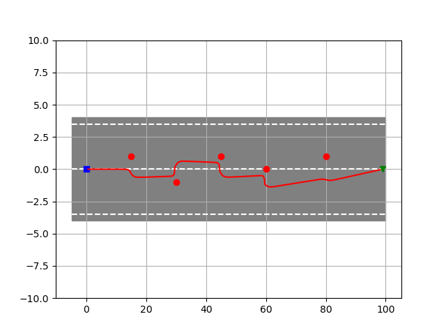
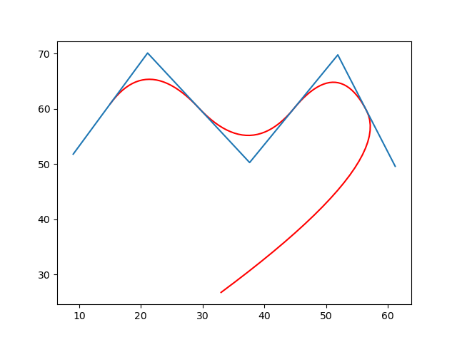
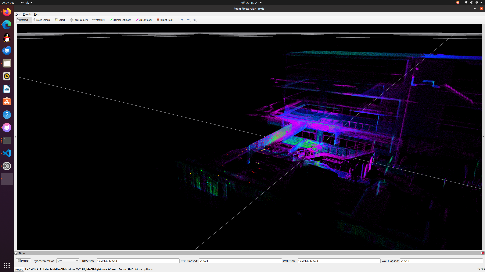

# ***导航***

---

_9.15_

目前正在看华南农业大学和哈工大的导航，接受其他开源的精华，学习共享内存中.....

_9.15 ~ 9.20_

##### 1.学习了大量的数学知识
##### 2.学习了全局，局部规划路线算法
###### 部分算法运行如下:

~~如要查看全部运行结果请移步 images~~

| apf | B_spline |
| :---: | :---: |
| | |

_9.20 ~ 9.29_

##### 成功复现 FAST_LIO and Point_LIO

_9.29 ~ 10.9_

##### 成功复现 IST_vision code and sp_vision code 

_10.9 ~11.4_

##### slam  
