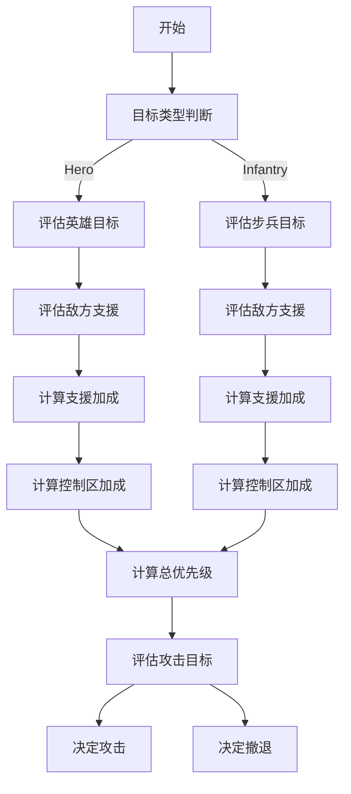
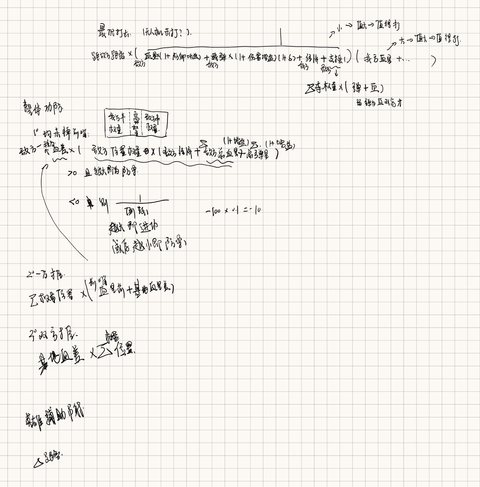

# 9.12
## 代码(SCU_2025)运行结果：

使用的25赛季官方地图、读取开源的现场视频

# 9.13
## 港科开源

* 梳理目录结构和文件内容
* 看投影位置计算（射线投影）的具体过程

# 9.14
## 相机成像原理

* 从世界坐标系到相机坐标系到照片上像素点的变化以及逆过程

## 港科开源

* 实际是图片像素转化到相机坐标系在到世界坐标系，再通过光心与实际坐标的连线与实际地图的plc交点即为世纪坐标

* 这种方式相对于传统的透视变化，具有更好的抗干扰性，在斜坡等非平地位置能够更好地解算出实际坐标位置

# 9.15~9.21
## 修改ABB比赛模型（用深度学习的方法去识别机械臂的转动角度无标定相机内外参等）的一些心得

* 并不是模型的参数越大训练出来的效果越好，我从原来的ResNet18改到了ResNet50后出现了明显的过拟合效应，应该是数据量较小但是模型层数与参数过大导致过拟合

* 加入了时间上的建模但是效果不明显且大大减慢了学习推理速度，浪费了算力

* 注意到了实际推理的视频具有连续性，在推理时加强了最终的平滑

* 机器学习很好的一个教程[李沐学AI](https://www.bilibili.com/video/BV1if4y147hS/?spm_id_from=333.337.search-card.all.click&vd_source=f5d67b6263fc5e307cc830f79e320af5)

# 9.22~9.24

ABB参赛

# 9.25~9.26

* 看线代，数学能力太差

# 9.27~10.08

## 计划与安排

- [ ]自瞄开源跑通（中南和同济）
- [ ]做港科开源中更改地图的点云图
- [ ]验证新地图下雷达的精度

## 具体完成情况
- [ ]中南自瞄已经测试完成
- [ ]同济自瞄已经能上车测试
- [ ]楼下大坑的基本建图已经完成

## 相关问题与解决方法

- [ ]中南：自瞄对横向移动的车急停会影响追踪（追踪不上向一个方向移动后快速反向）
    
    - [ ]~~解决方法(暂时想法)：使用IMM+机动检测+自适应Q~~
       
        1. ~~IMM：设定几个常见的模型，如CV（匀速）、CA（匀加速）、CTRV（匀速转弯），同时运行多个滤波器，根据观测误差（残差/似然），给出不同权重，最后融合计算~~

        2. ~~机动检测： IMM在预测时会花费几帧，机动检测能触发“保守策略”，即缩短预测步长、临时用零速模型、放大过程噪声（更相信测量），从而避免在危险几帧打偏~~

        3. ~~自适应Q：让IMM中每个滤波器都能“自适应”~~

           (已测试效果不好)


- [ ]同济：主要是标定和坐标系转化有问题
           
     1. 对于圆点标定：圆点标定时，要修改两个文件中的参数，一个是在configs-calibration.yaml中修改pattern_cols，pattern_rows，enter_distance_mm（横向圆点数、纵向圆点数，圆点间间距），其次是在calibration-capture.cpp中修改47～50中写死的Size值
     
     ```yaml
     // configs-calibration.yaml
     pattern_cols: 10
     pattern_rows: 7
     center_distance_mm: 40
     ```

     ```cpp
     // calibration-capture.cpp
     std::vector<cv::Point2f> centers_2d;
    auto success = cv::findCirclesGrid(img, cv::Size(10, 7), centers_2d);  // 默认是对称圆点图案
    cv::drawChessboardCorners(img_with_ypr, cv::Size(10, 7), centers_2d, success);  // 显示识别结果
    cv::resize(img_with_ypr, img_with_ypr, {}, 0.5, 0.5);  // 显示时缩小图片尺寸
    ```

    2. 对于手眼标定：在进行手眼标定时，应该保持标定板的位置不动，云台动，从而获取到在该标定板位置，不同位置云台的pitch和yaw

    3. 对于坐标系转化：如果上述问题均以解决，还是出现识别预测到的装甲板位置相差较大，则需考虑坐标系变化是否有问题，具体在configs-calibration.yaml中

    ```yaml
    // configs-calibration.yaml
    R_gimbal2imubody: [1, 0, 0, 0, 1, 0,  0, 0, 1]
    ```

# 10.09~10.12

## 关于港科雷达站调试tips

1. 建图：港科需要ply格式的地图，可以用solidworks建好图后导出为stl格式再用open3d转化为ply格式，也可直接安装mashlab后建图（具体转化代码和安装指令见下），一定要注意坐标轴的方向，如果坐标轴位置发生了改变需要修改以下两个文件中的参数

```python
# stl转化ply的python脚本

import open3d as o3d

# 读取 STL 文件
mesh = o3d.io.read_triangle_mesh("/home/thr/stl2ply/stl/test.STL")

# 转换为点云（如果需要）或直接保存网格
# 如果你的STL是网格，直接保存
o3d.io.write_triangle_mesh("/home/thr/stl2ply/ply/test.ply", mesh)

print("转换完成，已保存为 /home/thr/stl2ply/ply/test.ply")

```

```bash
// 安装meshlab
sudo apt update
sudo apt install meshlab

// 打开meshlab
meshlab
```

```txt
# transform-kepoint_6.txt
# 这个文件中的三个坐标排列顺序为(x,y,z)其值为世界坐标值（也是ply中的坐标值），单位为m

-4.430 0.803 3.969
-3.857   1.748  -2.907 
-3.55    0.735 -10.334 
-0.344   2.598   0.35
2.299   0.273 -10.975
4.21    0.403   3.531
```

```python
# transform-solidwork2uwb.py
# 修改pos_x和pos_y的计算方式（如果坐标系发生了改变）
def solidwork2uwb(pos_3d: List[float], faction: FACTION = FACTION.RED) -> List[float]:
    x, y, z = pos_3d
    if (
        faction == FACTION.RED
        or faction == FACTION.UNKONWN
    ):
        pos_x = (-z + 14.0)
        pos_y = (-x + 7.5)
    elif faction == FACTION.BLUE:
        x, y, z = pos_3d
        pos_x = 28.0 - (-z + 14.0)
        pos_y = 15.0 - (-x + 7.5)
    return pos_x, pos_y
```

# 10.12~10.17

车坏了，没有测试，全看代码

## 港科雷达问题

没有给出上场的模型权重文件，在考虑是否需要重新训练模型

## 厦门理工雷达问题

采用透视变化，在斜坡等非平地区域的预测结果较差

## 港科和厦门理工雷达对比

| 对比项目 | 港科 | 厦门理工 |
|----|----|----|
| 计算方法 | 射线求交算位置 | 透视变化算位置 |
| 精度 | 很高在任何的位置 | 在平地位置和港科基本无差距，在斜坡高地等位置较差 |
| 算理要求 | 计算射线交点时所需算力较大 | 不需要很大的算力 |
| 地图建立难度 | 需要建立点云图 | 直接拍照或者选用地图即可 |
| 难点| 模型需要重新制作数据集训练，新地图建立要建模 | 标定点太多，赛前标定太复杂，可能时间不够 |

# 10.17~10.25

## 新规则下需要量雷达做决策（参考ai给出的决策方式）

整个流程包括**敌我支援计算**、**目标优先级计算**、**场地控制权**、以及**权重动态调整**，每个决策步骤都有明确的参数和计算方式。

### 1. **整体决策树结构**：

这是一个分层的决策树结构，用于评估各种决策路径。每个节点的计算结果会决定是否进入下一级决策条件。



---

### 2. **决策流程解析**：

#### **目标类型判断**

目标的类型首先被识别为 **Hero（英雄机器人）** 或 **Infantry（步兵机器人）**。此时会选择不同的决策路径来处理它们，因为它们的威胁评估和支援计算方式不同。

* **Hero**（英雄机器人）：远程打击、高输出、高血量
* **Infantry**（步兵机器人）：近战打击、机动性强、输出短时间高

---

#### **评估敌方支援（Enemy Support）**

敌方支援的计算是基于以下几个参数：

* **敌方支援的机器人类型（Hero 或 Infantry）**
* **敌方机器人与目标的距离**
* **敌方机器人的攻击方向（朝向目标）**
* **敌方机器人是否有足够的弹药进行攻击**

---

#### **评估我方支援（Ally Support）**

与敌方支援计算类似，但我方支援需要考虑以下因素：

* **我方机器人的类型（Hero 或 Infantry）**
* **我方机器人与目标的距离**
* **我方机器人的攻击方向**
* **我方是否有足够的弹药**

---

#### **计算目标优先级（Score Calculation）**

目标优先级的计算包括对敌方威胁、支援、残血等因素的综合评估。目标的最终优先级分数（Score）

---

#### **评估攻击目标**

目标优先级计算后，如果某个目标的分数超过一定阈值（例如0.7），则进入“攻击”阶段。此时，我们还需要评估是否有足够的支援、目标是否暴露在敌人攻击范围内等。

* **攻击优先级**：如果某目标的 `score` 高于某个阈值，并且我方有足够的支援，就执行攻击。如果敌方支援很强，但我方支援薄弱，优先考虑撤退或等待支援。
* **撤退判断**：当目标的攻击威胁过高（敌方威胁超过阈值）且我方支援不足时，系统会决定撤退。

---

#### **决定攻击或撤退**

* **攻击**：如果目标分数高，并且有足够的支援（队友支援、自己剩余弹药、敌方威胁较低），则选择攻击。
* **撤退**：如果目标分数较低，并且敌方支援过强、我方支援薄弱，则选择撤退。

# 10.26~11.13

## 对决策的具体函数表达式的定义

(由于函数表达式很难打，先暂时放一张截图在这里，后期有空在将具体的表达式打出来好看些)



## 将夏门理工学院的的main.py做模块化的改进

在厦门理工大学雷达站的开源中，main.py是一个长达1000多行的代码，在可维护性上很困难，于是我将其改为了100多行。

在main.py中只去调用相关功能代码，在core文件夹下可以添加或修改功能代码，这样便于后期做无人机追踪、决策计算和盲区预测等功能的开发与加入

下面给出模块化的git地址：

`<git@github.com:ISTvision26/IST_Radar.git>`

# 11.14~11.23

## 决策初代

### 单个机器人最优击杀

$ d * (\frac{1}{op_{life}(1+defense)+op_{bullet}(1+op_{harm})(op_{aim}+\Delta op_{aim})+op_{money}+\sum_{i=1}^{n-1}weight(other_{op_{bullet}}(1+op_{harm})(op_{aim}+\Delta op_{aim})+other_{op_{life}})})*(my_{life}(1+defense)+my_{bullet}(1+my_{harm})(my_{aim}+\Delta my_{aim})+my_{money}+\sum_{i=1}^{n-1}weight(other_{my_{bullet}}(1+my_{harm})(my_{aim}+\Delta my_{aim})+other_{my_{life}})) $

此值越大，越值得攻击，越小越不值得

### 整体攻防决策

$ \Delta all_{life}*(op_{money}+\sum_{i=1}^{n}op_{distance_{weight}}(op_{life}(1+defense)+op_{bullet}(1+harm)(op_{aim}+\Delta op_{aim})))*(\frac{1}{my_{money}+\sum_{i=1}^{n}my_{distance_{weight}}(my_{life}(1+defense)+my_{bullet}(1+harm)(my_{aim}+\Delta my_{aim}))}) $

此值大于零时越大，需要防守，越小需要进攻
此值小于零时越大，需要进攻，越小需要防守

### 参数说明

$ d $：我方某车距离敌方某车的距离

$ op_{life} $：敌方某车血量

$ defense $：防御增益

$ op_{bullet} $：敌方某车载弹量

$ harm $：攻击增益

$ op_{aim} $:命中率

$ \Delta op_{aim} $：命中率波动

$ op_{money} $：敌方经济

$ weight $：车权重

$ other_{op_{bullet}} $：除某车外其他车载弹量

$ other_{op_{life}} $：除某车外其他车血量

$ all_{life} $:前哨站+基地血量差

$ op_{distance_{weight}} $：敌方位置权重

my为我方

# 11.24~11.30

## Docker相关问题

### Docker Images Pusher

使用Github Action将国外的Docker镜像转存到阿里云私有仓库，供国内服务器使用，免费易用<br>
- 支持DockerHub, gcr.io, k8s.io, ghcr.io等任意仓库<br>
- 支持最大40GB的大型镜像<br>
- 使用阿里云的官方线路，速度快<br>

视频教程：https://www.bilibili.com/video/BV1Zn4y19743/

#### 使用方式

##### 配置阿里云
登录阿里云容器镜像服务<br>
https://cr.console.aliyun.com/<br>
启用个人实例，创建一个命名空间（**ALIYUN_NAME_SPACE**）


访问凭证–>获取环境变量<br>
用户名（**ALIYUN_REGISTRY_USER**)<br>
密码（**ALIYUN_REGISTRY_PASSWORD**)<br>
仓库地址（**ALIYUN_REGISTRY**）<br>


##### Fork本项目
Fork本项目<br>
###### 启动Action
进入您自己的项目，点击Action，启用Github Action功能<br>
###### 配置环境变量
进入Settings->Secret and variables->Actions->New Repository secret

将上一步的**四个值**<br>
ALIYUN_NAME_SPACE,ALIYUN_REGISTRY_USER，ALIYUN_REGISTRY_PASSWORD，ALIYUN_REGISTRY<br>
配置成环境变量

##### 添加镜像
打开images.txt文件，添加你想要的镜像 
可以加tag，也可以不用(默认latest)<br>
可添加 --platform=xxxxx 的参数指定镜像架构<br>
可使用 k8s.gcr.io/kube-state-metrics/kube-state-metrics 格式指定私库<br>
可使用 #开头作为注释<br>

文件提交后，自动进入Github Action构建

##### 使用镜像
回到阿里云，镜像仓库，点击任意镜像，可查看镜像状态。(可以改成公开，拉取镜像免登录)


在国内服务器pull镜像, 例如：<br>
```
docker pull registry.cn-hangzhou.aliyuncs.com/shrimp-images/alpine
```
registry.cn-hangzhou.aliyuncs.com 即 ALIYUN_REGISTRY(阿里云仓库地址)<br>
shrimp-images 即 ALIYUN_NAME_SPACE(阿里云命名空间)<br>
alpine 即 阿里云中显示的镜像名<br>

##### 多架构
需要在images.txt中用 --platform=xxxxx手动指定镜像架构
指定后的架构会以前缀的形式放在镜像名字前面


##### 镜像重名
程序自动判断是否存在名称相同, 但是属于不同命名空间的情况。
如果存在，会把命名空间作为前缀加在镜像名称前。
例如:
```
xhofe/alist
xiaoyaliu/alist
```


##### 定时执行
修改/.github/workflows/docker.yaml文件
添加 schedule即可定时执行(此处cron使用UTC时区)


### Docker官方安装包 

24年6月以来，大量Docker镜像网站停服，Docker无法下载安装<br>
本仓库致力于解决国内网络原因无法使用Docker的问题。<br>

##### 特点：
- 使用Github Action将官网的安装脚本/安装包定时下载到本项目Release，供国内使用<br>
- 官方安装包，安全可靠<br>
- 每天自动定时同步，保证最新<br>

#### 1. Docker安装
##### 1.1 Linux
一键安装命令
```
sudo curl -fsSL https://get.docker.com| bash -s docker --mirror Aliyun
```

备用命令（每天自动从官网定时同步）
```
sudo curl -fsSL https://github.com/tech-shrimp/docker_installer/releases/download/latest/linux.sh| bash -s docker --mirror Aliyun
```

> 备用2（如果Github访问不了，可以使用Gitee的链接）<br>
```
sudo curl -fsSL https://gitee.com/tech-shrimp/docker_installer/releases/download/latest/linux.sh| bash -s docker --mirror Aliyun
```

启动docker
```
sudo service docker start
```

##### 1.2 Windows
任务栏搜索功能，启用"适用于Linux的Windows子系统" + "虚拟机平台" <br>


管理员权限打开命令提示符，安装wsl2<br>
```
wsl --set-default-version 2
wsl --update --web-download
```
等待wsl安装成功

下载Windows版本安装包，进入此项目的Release<br>
https://github.com/tech-shrimp/docker_installer/releases

下载Windows版本安装包

双击安装即可

>可选:
如果想自己指定安装目录，可以使用命令行的方式
参数 --installation-dir=D:\Docker可以指定安装位置


```
start /w "" "Docker Desktop Installer.exe" install --installation-dir=D:\Docker
```

##### 1.3 Mac
下载Mac系统的安装包<br>
https://github.com/tech-shrimp/docker_installer/releases

注意区分CPU架构类型 Intel芯片选择x86_64, 苹果芯片选择arm64<br>
下载好双击安装即可

#### 2. Pull镜像

##### 方案一  转存到阿里云
使用Github Action将国外的Docker镜像转存到阿里云私有仓库，供国内服务器使用，免费易用

- 支持DockerHub, gcr.io, k8s.io, ghcr.io等任意仓库
- 支持最大40GB的大型镜像
- 使用阿里云的官方线路，速度快

##### 方案二 镜像站
现在只有很少的国内镜像站存活<br>
不保证镜像齐全,且用且珍惜<br>
以下三个镜像站背靠较大的开源项目，优先推荐<br>

|项目名称|项目地址| 加速地址|
| ----------- | ----------- |----------- |
|1Panel|[https://github.com/1Panel-dev/1Panel/](https://github.com/1Panel-dev/1Panel/)|https://docker.1panel.live|
|Daocloud|[https://github.com/DaoCloud/public-image-mirror](https://github.com/DaoCloud/public-image-mirror)|https://docker.m.daocloud.io|
|耗子面板|[https://github.com/TheTNB/panel](https://github.com/TheTNB/panel 	)|https://hub.rat.dev|


###### Linux配置镜像站

```
sudo vi /etc/docker/daemon.json
```
输入下列内容，最后按ESC，输入 :wq! 保存退出。
```
{
    "registry-mirrors": [
        "https://docker.m.daocloud.io",
        "https://docker.1panel.live",
        "https://hub.rat.dev"
    ]
}
```
重启docker
```
sudo service docker restart
```

###### Windows/Mac配置镜像站
Setting->Docker Engine->添加上换源的那一段，如下图


##### 方案三 离线镜像
使用Github Action下载docker离线镜像
https://github.com/wukongdaily/DockerTarBuilder

##### 方案四 使用一键脚本
bash -c "$(curl -sSLf https://xy.ggbond.org/xy/docker_pull.sh)" -s 完整镜像名

##### 方案五 使用Cloudflare worker 自建镜像加速
https://github.com/cmliu/CF-Workers-docker.io

#### 3. 去哪里找镜像

https://docker.fxxk.dedyn.io/

## 决策问题

### 参数调整

调整决策时的参数和权重，现在决策似乎有一点问题

### 模型调整

不能依靠于单一模型，对于不同兵种应该要设计不同的模型，如英雄需要冲家、步兵需要输出、工程不需要进攻策略等

# 联系方式

 QQ:2523774517
 
 email: 2523774515@qq.com
 
 WeChat:YikT_2631
 
 phone:19136311737
