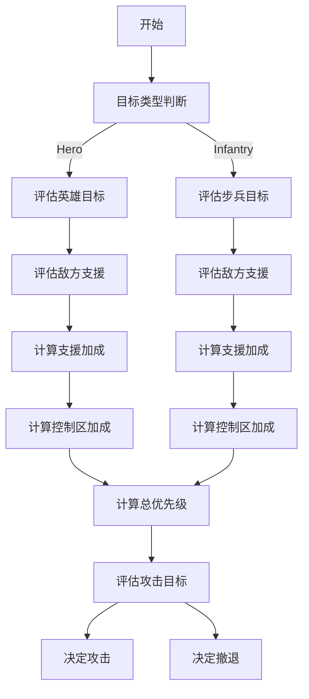

# 9.12
## 代码(SCU_2025)运行结果：

使用的25赛季官方地图、读取开源的现场视频

# 9.13
## 港科开源

* 梳理目录结构和文件内容
* 看投影位置计算（射线投影）的具体过程

# 9.14
## 相机成像原理

* 从世界坐标系到相机坐标系到照片上像素点的变化以及逆过程

## 港科开源

* 实际是图片像素转化到相机坐标系在到世界坐标系，再通过光心与实际坐标的连线与实际地图的plc交点即为世纪坐标

* 这种方式相对于传统的透视变化，具有更好的抗干扰性，在斜坡等非平地位置能够更好地解算出实际坐标位置

# 9.15~9.21
## 修改ABB比赛模型（用深度学习的方法去识别机械臂的转动角度无标定相机内外参等）的一些心得

* 并不是模型的参数越大训练出来的效果越好，我从原来的ResNet18改到了ResNet50后出现了明显的过拟合效应，应该是数据量较小但是模型层数与参数过大导致过拟合

* 加入了时间上的建模但是效果不明显且大大减慢了学习推理速度，浪费了算力

* 注意到了实际推理的视频具有连续性，在推理时加强了最终的平滑

* 机器学习很好的一个教程[李沐学AI](https://www.bilibili.com/video/BV1if4y147hS/?spm_id_from=333.337.search-card.all.click&vd_source=f5d67b6263fc5e307cc830f79e320af5)

# 9.22~9.24

ABB参赛

# 9.25~9.26

* 看线代，数学能力太差

# 9.27~10.08

## 计划与安排

- [ ]自瞄开源跑通（中南和同济）
- [ ]做港科开源中更改地图的点云图
- [ ]验证新地图下雷达的精度

## 具体完成情况
- [ ]中南自瞄已经测试完成
- [ ]同济自瞄已经能上车测试
- [ ]楼下大坑的基本建图已经完成

## 相关问题与解决方法

- [ ]中南：自瞄对横向移动的车急停会影响追踪（追踪不上向一个方向移动后快速反向）
    
    - [ ]~~解决方法(暂时想法)：使用IMM+机动检测+自适应Q~~
       
        1. ~~IMM：设定几个常见的模型，如CV（匀速）、CA（匀加速）、CTRV（匀速转弯），同时运行多个滤波器，根据观测误差（残差/似然），给出不同权重，最后融合计算~~

        2. ~~机动检测： IMM在预测时会花费几帧，机动检测能触发“保守策略”，即缩短预测步长、临时用零速模型、放大过程噪声（更相信测量），从而避免在危险几帧打偏~~

        3. ~~自适应Q：让IMM中每个滤波器都能“自适应”~~

           (已测试效果不好)


- [ ]同济：主要是标定和坐标系转化有问题
           
     1. 对于圆点标定：圆点标定时，要修改两个文件中的参数，一个是在configs-calibration.yaml中修改pattern_cols，pattern_rows，enter_distance_mm（横向圆点数、纵向圆点数，圆点间间距），其次是在calibration-capture.cpp中修改47～50中写死的Size值
     
     ```yaml
     // configs-calibration.yaml
     pattern_cols: 10
     pattern_rows: 7
     center_distance_mm: 40
     ```

     ```cpp
     // calibration-capture.cpp
     std::vector<cv::Point2f> centers_2d;
    auto success = cv::findCirclesGrid(img, cv::Size(10, 7), centers_2d);  // 默认是对称圆点图案
    cv::drawChessboardCorners(img_with_ypr, cv::Size(10, 7), centers_2d, success);  // 显示识别结果
    cv::resize(img_with_ypr, img_with_ypr, {}, 0.5, 0.5);  // 显示时缩小图片尺寸
    ```

    2. 对于手眼标定：在进行手眼标定时，应该保持标定板的位置不动，云台动，从而获取到在该标定板位置，不同位置云台的pitch和yaw

    3. 对于坐标系转化：如果上述问题均以解决，还是出现识别预测到的装甲板位置相差较大，则需考虑坐标系变化是否有问题，具体在configs-calibration.yaml中

    ```yaml
    // configs-calibration.yaml
    R_gimbal2imubody: [1, 0, 0, 0, 1, 0,  0, 0, 1]
    ```

# 10.09~10.12

## 关于港科雷达站调试tips

1. 建图：港科需要ply格式的地图，可以用solidworks建好图后导出为stl格式再用open3d转化为ply格式，也可直接安装mashlab后建图（具体转化代码和安装指令见下），一定要注意坐标轴的方向，如果坐标轴位置发生了改变需要修改以下两个文件中的参数

```python
# stl转化ply的python脚本

import open3d as o3d

# 读取 STL 文件
mesh = o3d.io.read_triangle_mesh("/home/thr/stl2ply/stl/test.STL")

# 转换为点云（如果需要）或直接保存网格
# 如果你的STL是网格，直接保存
o3d.io.write_triangle_mesh("/home/thr/stl2ply/ply/test.ply", mesh)

print("转换完成，已保存为 /home/thr/stl2ply/ply/test.ply")

```

```bash
// 安装meshlab
sudo apt update
sudo apt install meshlab

// 打开meshlab
meshlab
```

```txt
# transform-kepoint_6.txt
# 这个文件中的三个坐标排列顺序为(x,y,z)其值为世界坐标值（也是ply中的坐标值），单位为m

-4.430 0.803 3.969
-3.857   1.748  -2.907 
-3.55    0.735 -10.334 
-0.344   2.598   0.35
2.299   0.273 -10.975
4.21    0.403   3.531
```

```python
# transform-solidwork2uwb.py
# 修改pos_x和pos_y的计算方式（如果坐标系发生了改变）
def solidwork2uwb(pos_3d: List[float], faction: FACTION = FACTION.RED) -> List[float]:
    x, y, z = pos_3d
    if (
        faction == FACTION.RED
        or faction == FACTION.UNKONWN
    ):
        pos_x = (-z + 14.0)
        pos_y = (-x + 7.5)
    elif faction == FACTION.BLUE:
        x, y, z = pos_3d
        pos_x = 28.0 - (-z + 14.0)
        pos_y = 15.0 - (-x + 7.5)
    return pos_x, pos_y
```

# 10.12~10.17

车坏了，没有测试，全看代码

## 港科雷达问题

没有给出上场的模型权重文件，在考虑是否需要重新训练模型

## 厦门理工雷达问题

采用透视变化，在斜坡等非平地区域的预测结果较差

## 港科和厦门理工雷达对比

| 对比项目 | 港科 | 厦门理工 |
|----|----|----|
| 计算方法 | 射线求交算位置 | 透视变化算位置 |
| 精度 | 很高在任何的位置 | 在平地位置和港科基本无差距，在斜坡高地等位置较差 |
| 算理要求 | 计算射线交点时所需算力较大 | 不需要很大的算力 |
| 地图建立难度 | 需要建立点云图 | 直接拍照或者选用地图即可 |
| 难点| 模型需要重新制作数据集训练，新地图建立要建模 | 标定点太多，赛前标定太复杂，可能时间不够 |

# 10.17~10.25

## 新规则下需要量雷达做决策

整个流程包括**敌我支援计算**、**目标优先级计算**、**场地控制权**、以及**权重动态调整**，每个决策步骤都有明确的参数和计算方式。

### 1. **整体决策树结构**：

这是一个分层的决策树结构，用于评估各种决策路径。每个节点的计算结果会决定是否进入下一级决策条件。



---

### 2. **决策流程解析**：

#### **目标类型判断**

目标的类型首先被识别为 **Hero（英雄机器人）** 或 **Infantry（步兵机器人）**。此时会选择不同的决策路径来处理它们，因为它们的威胁评估和支援计算方式不同。

* **Hero**（英雄机器人）：远程打击、高输出、高血量
* **Infantry**（步兵机器人）：近战打击、机动性强、输出短时间高

---

#### **评估敌方支援（Enemy Support）**

敌方支援的计算是基于以下几个参数：

* **敌方支援的机器人类型（Hero 或 Infantry）**
* **敌方机器人与目标的距离**
* **敌方机器人的攻击方向（朝向目标）**
* **敌方机器人是否有足够的弹药进行攻击**

敌方支援的计算公式：
[
\text{Enemy Support Term} = \sum_{k \in \text{enemies}} \beta_{type(k)} \cdot \text{inRange}(k, target) \cdot \text{ammoFactor}(k) \cdot \text{angleFactor}(k, target) \cdot \exp\left(\frac{-\text{dist}(k, target)}{d_{decay}}\right)
]

* **(\beta_{type(k)})**：敌方类型加成（英雄为1.2，步兵为0.9）
* **(\text{inRange}(k, target))**：布尔值，表示敌方是否能在攻击范围内
* **(\text{ammoFactor}(k))**：敌方机器人的弹药余量因子，1为满弹，低于1则按比例缩放
* **(\text{angleFactor}(k, target))**：角度因子，若敌方朝向目标，则值为1；否则较低（如0.5）

---

#### **评估我方支援（Ally Support）**

与敌方支援计算类似，但我方支援需要考虑以下因素：

* **我方机器人的类型（Hero 或 Infantry）**
* **我方机器人与目标的距离**
* **我方机器人的攻击方向**
* **我方是否有足够的弹药**

我方支援的计算公式：
[
\text{Ally Support Term} = \sum_{j \in \text{allies}} \alpha_{type(j)} \cdot \text{inRange}(j, target) \cdot \text{ammoFactor}(j) \cdot \text{angleFactor}(j, target) \cdot \exp\left(\frac{-\text{dist}(j, target)}{d_{decay}}\right)
]

* **(\alpha_{type(j)})**：我方类型加成（英雄为1.0，步兵为0.8）
* **其余与敌方支援相同**

---

#### **计算目标优先级（Score Calculation）**

目标优先级的计算包括对敌方威胁、支援、残血等因素的综合评估。目标的最终优先级分数（Score）通过以下公式计算：

[
\text{score}*i = w*{hp} \cdot HP_term_i + w_{dist} \cdot Dist_term_i + w_{ammo} \cdot Ammo_term_i + w_{econ} \cdot Econ_term_i + w_{threat} \cdot Threat_term_i + w_{ally} \cdot AllySupport_term_i - w_{enemy} \cdot EnemySupport_term_i + w_{ctrl} \cdot Control_term_i
]

其中，各项参数的计算方式如下：

* **HP Term**：残血比例，(1 - \frac{HP}{max_HP})，残血越多，优先级越高
* **Dist Term**：距离衰减，(1 - \frac{dist}{max_range})，距离越近，优先级越高
* **Ammo Term**：弹药剩余比例，(1 - \frac{ammo}{max_ammo})，弹药越多，优先级越高
* **Econ Term**：经济状态，(1 - \frac{econ}{max_econ})，经济越好，优先级越高
* **Threat Term**：敌方威胁值，基于敌人武器、攻击模式等因素计算
* **AllySupport Term**：我方支援，表示距离目标最近、朝向目标并具有攻击能力的我方机器人的支援强度
* **EnemySupport Term**：敌方支援，表示敌方机器人对目标的支援能力
* **Control Term**：场地控制权，表示目标是否位于敌方或我方控制的区域内

每个权重（(w_i)）会根据目标类型（Hero 或 Infantry）进行调整，如下所示：

| 权重项          | Hero（英雄） | Infantry（步兵） |
| ------------ | -------- | ------------ |
| **hp_w**     | 0.20     | 0.35         |
| **dist_w**   | 0.25     | 0.30         |
| **ammo_w**   | 0.10     | 0.15         |
| **econ_w**   | 0.05     | 0.10         |
| **threat_w** | 0.25     | 0.10         |
| **ally_w**   | 0.10     | 0.10         |
| **enemy_w**  | 0.35     | 0.25         |
| **ctrl_w**   | 0.10     | 0.05         |

---

#### **评估攻击目标**

目标优先级计算后，如果某个目标的分数超过一定阈值（例如0.7），则进入“攻击”阶段。此时，我们还需要评估是否有足够的支援、目标是否暴露在敌人攻击范围内等。

* **攻击优先级**：如果某目标的 `score` 高于某个阈值，并且我方有足够的支援，就执行攻击。如果敌方支援很强，但我方支援薄弱，优先考虑撤退或等待支援。
* **撤退判断**：当目标的攻击威胁过高（敌方威胁超过阈值）且我方支援不足时，系统会决定撤退。

---

#### **决定攻击或撤退**

* **攻击**：如果目标分数高，并且有足够的支援（队友支援、自己剩余弹药、敌方威胁较低），则选择攻击。
* **撤退**：如果目标分数较低，并且敌方支援过强、我方支援薄弱，则选择撤退。

### 3. **具体的计算与调优示例**

以下是一些计算实例，假设某敌方目标是敌方英雄机器人，且我方有两名步兵机器人支援：

#### **敌方支援计算**：

* **敌方 Hero**：距离目标 10m，朝向目标，弹药充足。
* **敌方步兵**：距离目标 15m，不完全朝向目标，弹药不足。

**敌方支援计算公式**：
[
E_k = 1.2 \cdot 1 \cdot 1 \cdot \exp\left(\frac{-10}{6}\right) + 0.9 \cdot 0.5 \cdot 0.5 \cdot \exp\left(\frac{-15}{6}\right)
]
得出：
[
E_k = 1.2 \cdot 1 \cdot 1 \cdot 0.5134 + 0.9 \

ps:上述公式和参数可能会修改，具体修改方式见下

# 联系方式

 QQ:2523774517
 
 email: 2523774515@qq.com
 
 WeChat:YikT_2631
 
 phone:19136311737
