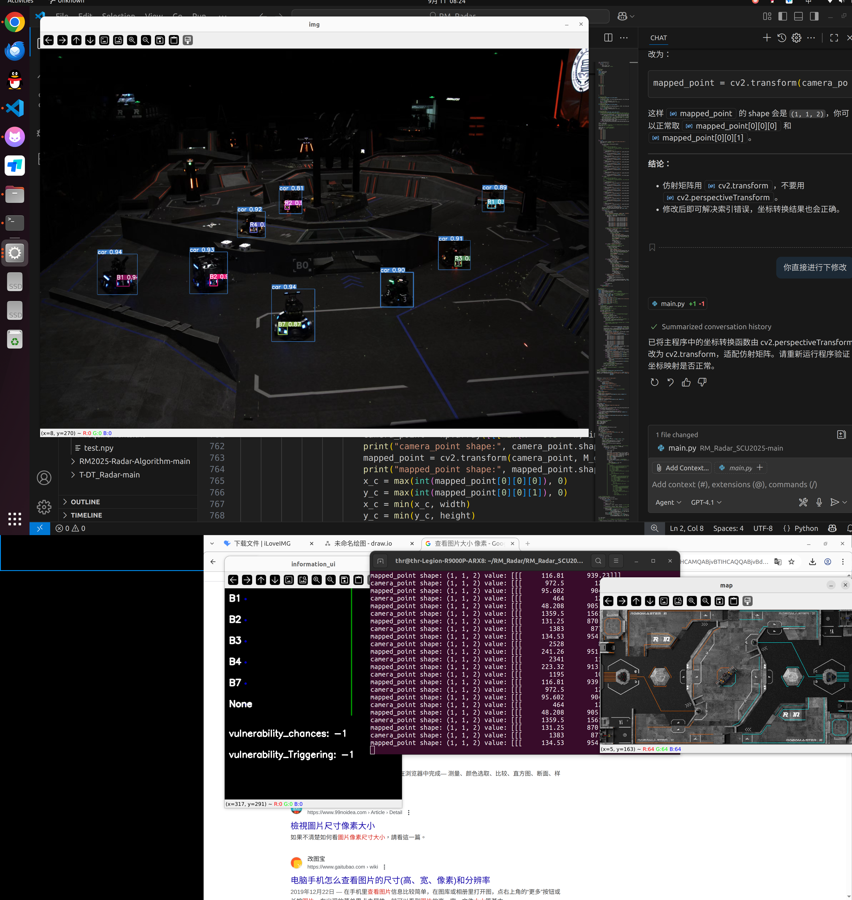

# 9.12
## 代码(SCU_2025)运行结果：

使用的25赛季官方地图、读取开源的现场视频

# 9.13
## 港科开源

* 梳理目录结构和文件内容
* 看投影位置计算（射线投影）的具体过程

# 9.14
## 相机成像原理

* 从世界坐标系到相机坐标系到照片上像素点的变化以及逆过程

## 港科开源

* 实际是图片像素转化到相机坐标系在到世界坐标系，再通过光心与实际坐标的连线与实际地图的plc交点即为世纪坐标

* 这种方式相对于传统的透视变化，具有更好的抗干扰性，在斜坡等非平地位置能够更好地解算出实际坐标位置

# 9.15~9.21
## 修改ABB比赛模型（用深度学习的方法去识别机械臂的转动角度无标定相机内外参等）的一些心得

* 并不是模型的参数越大训练出来的效果越好，我从原来的ResNet18改到了ResNet50后出现了明显的过拟合效应，应该是数据量较小但是模型层数与参数过大导致过拟合

* 加入了时间上的建模但是效果不明显且大大减慢了学习推理速度，浪费了算力

* 注意到了实际推理的视频具有连续性，在推理时加强了最终的平滑

* 机器学习很好的一个教程[李沐学AI](https://www.bilibili.com/video/BV1if4y147hS/?spm_id_from=333.337.search-card.all.click&vd_source=f5d67b6263fc5e307cc830f79e320af5)

# 9.22~9.24

ABB参赛

# 9.25~9.26

* 看线代，数学能力太差

# 9.27~10.08

## 计划与安排

- [ ]自瞄开源跑通（中南和同济）
- [ ]做港科开源中更改地图的点云图
- [ ]验证新地图下雷达的精度

## 具体完成情况

## 相关问题与解决方法

# 联系方式

 QQ:2523774517
 
 email: 2523774515@qq.com
 
 WeChat:19136311737
 
 phone:19136311737